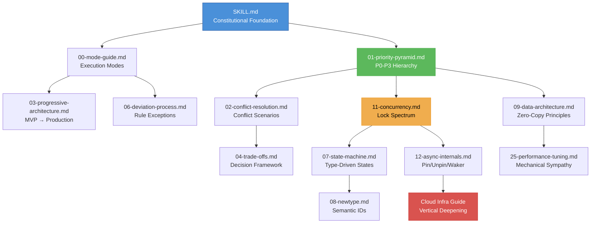

# Rust Architecture & Engineering Decision Guide V9.1.0 — The Rust 2024 Edition

This document serves as the **constitutional foundation** for Rust engineering decisions. It is structured for deterministic, reproducible decision-making suitable for AI-assisted development.

V9.0.0 introduced three paradigm shifts:
1. **Memory Layout Transparency** (ref/30): From "ideological safety" to "materialist physics" — struct padding audit, `#[repr(C)]` mandate, cache-friendly design
2. **Breakwater Architecture** (ref/31): Facade/Core layered pattern — ergonomic facade absorbs chaos, zero-overhead core maintains determinism
3. **Physical Feasibility Audit** (ref/32): Mandatory audit between initiation and design — I/O budget, memory ceiling, concurrency true cost

V9.1.0 — **Rust 2024 Edition Alignment**:
- Adopts Rust 2024 Edition idioms: `unsafe extern` blocks, RPIT lifetime capture, `impl Trait` in return position sugar
- Aligns with [Rust API Guidelines](https://rust-lang.github.io/api-guidelines/) checklist (C-CASE, C-CONV, C-MACRO-VIS, C-EXAMPLE)
- Integrates [Safety-Critical Rust Coding Guidelines](https://github.com/rustfoundation/safety-critical-rust-coding-guidelines) for unsafe code governance
- Adds `cargo-mutants` mutation testing, `kani` formal verification, `turmoil` network chaos to advanced testing arsenal

### Execution Mode

Before applying any rule, determine the execution mode:

- **`rapid`** (prototype): Enforce P0 only; `anyhow` in libraries, unlimited `.clone()`, no doc-tests
- **`standard`** (default): Enforce P0+P1; warn on P2 violations
- **`strict`** (production): Enforce P0-P3; all deviations require formal annotation

See [references/00-mode-guide.md](references/00-mode-guide.md) for full mode definitions.

### Mandatory Output Contract

**Every code generation or review output MUST end with a Decision Summary block:**

```markdown
## Decision Summary
- **Mode**: [rapid|standard|strict]
- **Edition**: [2021|2024] — Rust edition in use
- **Rules Applied**: [list specific rules from P0-P3]
- **Conflicts Resolved**: [PX > PY with justification, or "None"]
- **Deviations**: [list with `// DEVIATION: reason` references, or "None"]
- **Trade-offs**: [key trade-off decisions made]
- **External Alignment**: [relevant Rust API Guidelines / Safety-Critical guidelines matched]
```

---

## 1. Priority Decision Matrix

When conflicts arise, apply decisions top-down. Upper levels have absolute veto power.

| Level | Core Principle | Accept | Reject |
|:------|:--------------|:-------|:-------|
| **P0** | **Safety & Correctness** | Compile-time borrow checking, Miri-verified unsafe | Any UB, race conditions, unproven unsafe |
| **P1** | **Maintainability** | Semantic naming, ownership transfer, trait decoupling | Deeply nested lifetimes, overly complex generics |
| **P2** | **Engineering Efficiency** | `Box<dyn Trait>`, workspace division, feature isolation | Binary bloat from monomorphization |
| **P3** | **Runtime Performance** | SoA layout, lock-free, SIMD, profiling-proven | Intuition-based premature optimization |

---

## 2. Ownership & Memory Architecture Strategy

### Business Logic Layer

- Prefer owned types (`String`, `Vec<T>`)
- Allow `.clone()` to eliminate lifetime interference on non-hotpaths
- Prohibit storing non-`'static` references in structs, unless struct is transient view

### Performance Hotpaths Layer

- Zero-Copy Design: `Cow<'a, T>` or `bytes::Bytes` for cross-layer sharing
- Memory Layout: Enforce AoS → SoA conversion for bulk data
- Alignment: `#[repr(align(64))]` to eliminate false sharing

---

## 3. Error Handling Layering Specification

### Library Crate

- **Required**: `thiserror` or manual `Display` + `Error` trait
- **Prohibited**: Never return `anyhow::Error` from public API
- Error variants must contain sufficient context

### Application Binary

- Use `anyhow` with `?` operator for error propagation
- Attach `.with_context(|| ...)` at error propagation points
- Register global Panic Hook at `main` entry

---

## 4. Idiomatic Style: Jeet Kune Do Coding Philosophy

### Core Philosophy

| Principle | Description |
|-----------|-------------|
| **Intercepting Boilerplate** | If logic can be expressed in 1 line of pattern matching, never use 5 lines of nesting |
| **Economy of Motion** | Every line of code should point directly to intent. Eliminate redundant intermediate variables and implicit copies |
| **Hardware Sympathy** | Leverage iterators and zero-copy types, align with the compiler's inline optimization |

### Agent Self-Check List

1. **Are code paths flat?** Can `let else` or `?` eliminate `if let` nesting?
2. **Are manual loops eliminated?** Can collection processing be converted to iterator adapter chains?
3. **Are variable scopes minimized?** Can shadowing remove no-longer-needed `mut`?
4. **Are there implicit copies?** Is `.to_string()` or `.clone()` misused on hot paths?
5. **Is naming stuttering?** e.g., `user::UserConfig` should be `user::Config`.
6. **Is Rust 2024 Edition leveraged?** Are `unsafe extern` blocks used? Are RPIT captures explicit with `use<...>`?
7. **Are Clippy pedantic/nursery lints addressed?** For `strict` mode, no unjustified `#[allow]` on pedantic lints.

### Reduction Directive

When receiving a Rust coding task, fold the logic with Jeet Kune Do intuition before output — ensuring every line of code carries maximum energy density. The goal is **high signal-to-noise ratio**.

---

## 5. Agent Execution & Self-Review Directives

**MUST** execute the following workflow before outputting any Rust solution:

### Trade-off Analysis

```rust
// Trade-off Analysis:
// - P1 (simplicity): Using String.clone() adds ~2KB runtime allocation
// - P3 (performance): Acceptable for this cold path (config loading)
// - Decision: Clone for clarity; revisit if profiling shows bottleneck
```

### Review Checklists

- **Ownership**: Unnecessary lifetime annotations removed? Large objects boxed before `.await`?
- **Concurrency**: `std::sync::Mutex` held during `await`? Blocking ops in async context?
- **Error Robustness**: All `unwrap()` have `expect("REASON")`? External IO handles timeout?
- **Safety**: Unsafe blocks have SAFETY comments? FFI uses opaque handles? `catch_unwind` on `extern "C"`?

---

## 6. Typical Refactoring Paths

| From | To | Signal |
|------|----|--------|
| `Option/bool` flags | `Enum` state machine | Business model stabilizing |
| `String` storage | `Cow<'a, str>` or `Arc<str>` | Hot path optimization needed |
| Manual `for` loops | Iterator chaining | Collection processing code |
| MVP `Option` fields | Type-driven state machine | Core domain logic stable |

---

## 7. Production Observability Specification

- **Tracing**: All `pub async fn` annotated with `#[tracing::instrument]`; skip large objects
- **Metrics**: Static labels; atomic counters on hot paths; Prometheus pull model
- **Panic Hook**: Global hook at `main`; synchronous write; `std::process::abort()` over unwinding

---

## 8. Reference Files

### Document Relationship Map



### Execution & Strategy (7)
- [00-mode-guide.md](references/00-mode-guide.md) — Execution modes and transition checklists
- [01-priority-pyramid.md](references/01-priority-pyramid.md) — The four-level hierarchy
- [02-conflict-resolution.md](references/02-conflict-resolution.md) — Typical conflicts and resolutions
- [03-progressive-architecture.md](references/03-progressive-architecture.md) — MVP to production migration
- [04-trade-offs.md](references/04-trade-offs.md) — Decision analysis framework
- [05-glossary.md](references/05-glossary.md) — Centralized terminology definitions
- [06-deviation-process.md](references/06-deviation-process.md) — Formal rule exception handling

### Architecture Patterns (14)
- **State & Types**
  - [07-state-machine.md](references/07-state-machine.md) — Type-driven state machines
  - [08-newtype.md](references/08-newtype.md) — Type-safe IDs and credentials
  
- **Data & Memory** (P0-P1)
  - [09-data-architecture.md](references/09-data-architecture.md) — Ownership, cloning, zero-copy, Arena basics
  
- **Error Handling** (P0-P1)
  - [10-error-handling.md](references/10-error-handling.md) — Library (`thiserror`) vs application (`anyhow`) strategies
  
- **Concurrency & Async** (P0-P3)
  - [11-concurrency.md](references/11-concurrency.md) — Lock spectrum, decision tree, async isolation (P0-P1)
  - [12-async-internals.md](references/12-async-internals.md) — Pin/Unpin, Waker, custom executors (P2-P3)
  
- **API & Safety**
  - [13-api-design.md](references/13-api-design.md) — Public API boundaries, `#[non_exhaustive]`, sealed traits
  - [15-ffi-interop.md](references/15-ffi-interop.md) — The Defense Wall: FFI safety boundaries (P0)
  
- **Metaprogramming** (P1-P2)
  - [14-metaprogramming.md](references/14-metaprogramming.md) — Declarative/procedural macros, const generics
  
- **Observability**
  - [16-observability.md](references/16-observability.md) — Tracing, metrics, panic hooks
  
- **Tooling**
  - [17-toolchain.md](references/17-toolchain.md) — CI, Clippy, workspace, feature flags, rust-toolchain.toml pinning

### Modern CI & Formal Methods (V9.1.0 additions)
  - [33-ci-modern.md](references/33-ci-modern.md) — Modern CI/CD pipeline: cargo-mutants, kani, turmoil, deterministic RNG, rust-toolchain.toml

- **Memory Layout Transparency** (P0)
  - [30-memory-layout.md](references/30-memory-layout.md) — Struct padding audit, `#[repr(C)]` mandate, cache-friendly design, false sharing prevention
  
- **Breakwater Architecture** (P0-P1)
  - [31-breakwater-pattern.md](references/31-breakwater-pattern.md) — Facade/Core layered pattern, boundary interception protocol, type contraction
  
- **Physical Feasibility Audit** (P0)
  - [32-physical-audit.md](references/32-physical-audit.md) — Pre-design mandatory audit: I/O budget, memory ceiling, concurrency true cost

### Idiomatic Style (7)
- [18-control-flow.md](references/18-control-flow.md) — `let else`, `matches!`, intercepting deep nesting
- [19-iterators.md](references/19-iterators.md) — Iterator chains, `filter_map`, flowing force
- [20-traits.md](references/20-traits.md) — `From` vs `Into`, `Default`, Hardware Sympathy
- [21-errors.md](references/21-errors.md) — `unwrap_or_else`, `map_err`, `and_then`
- [22-data-struct.md](references/22-data-struct.md) — Field shorthand, type stuttering
- [23-borrowing.md](references/23-borrowing.md) — `AsRef`, `Cow`, memory economy
- [24-refactor.md](references/24-refactor.md) — Agent Self-Check List, Reduction Directive

### Deep Dive (P3 Only)
> ⚠️ **Requirement**: All P3 optimizations MUST include profiler data proving bottleneck

- [25-performance-tuning.md](references/25-performance-tuning.md) — Mechanical Sympathy: SoA, SIMD, Arena, PGO (P3 only)
- [26-advanced-testing.md](references/26-advanced-testing.md) — Formal verification: proptest, fuzz, Loom, Miri, kani, cargo-mutants, turmoil (strict mode)
- [27-review.md](references/27-review.md) — Production review checklist
- [28-usage-examples.md](references/28-usage-examples.md) — Real-world scenarios with Decision Summaries

---

## 9. Constitutional Summary

**No rule is absolute.** The ultimate measure of code quality is whether it matches:
- Its lifecycle stage (MVP vs production) — governed by [execution mode](references/00-mode-guide.md)
- Business constraints (deadline vs long-term maintenance)
- Team context (solo vs large organization)

**The Pragmatic Principle**:
> Pursue excellence at system boundaries and hot paths; release mental load for internal flows and cold paths.

**Deviation Protocol**: When breaking a rule is the correct decision, annotate with `// DEVIATION: reason` and record in the Decision Summary.

**Terminology**: All specialized terms are defined in [glossary.md](references/05-glossary.md).

**Remember**: This guide is the Agent's **constitutional foundation**. Before each response, generate a **Decision Summary** recording rationale for choosing specific implementation paths, ensuring consistency and professional depth.
