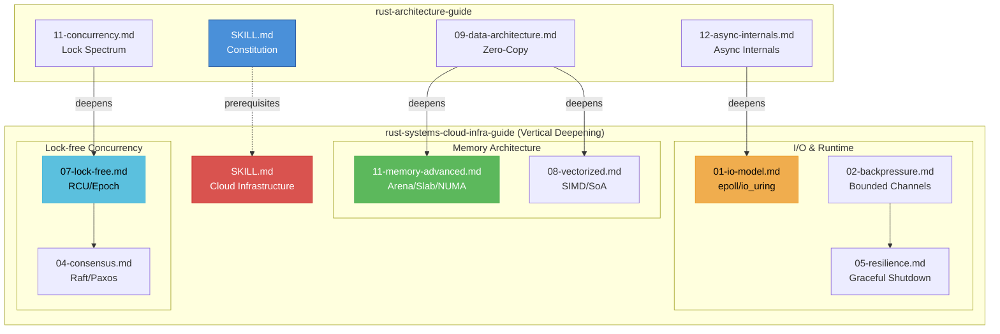

# Rust Systems & Cloud Infrastructure Guide V6.1.0

Vertical deepening of `rust-architecture-guide` for world-class cloud-native infrastructure. Assumes long-running nodes (uptime > 1 year), 10GbE+ network, multi-NUMA architecture.

V6.0.0 additions:
1. **Breakwater Pattern** (ref/12): Facade/Core layered architecture for cloud services — high-tolerance external API, zero-overload internal kernel
2. **Physical Feasibility Audit** (ref/13): Container memory limits, network latency budgets, NUMA topology awareness

V6.1.0 — **Modern Resilience & Observability**:
- Integrates `tokio-graceful-shutdown` and `async-shutdown` crate patterns for production-grade shutdown
- Adds `tokio::task::JoinSet` structured concurrency for task lifecycle management
- Incorporates Tokio official graceful shutdown best practices and `CancellationToken` patterns
- Adds `ntex-neon-uring` benchmark awareness for io_uring vs epoll trade-off quantification

## Core Philosophy

| Principle | Description |
|-----------|-------------|
| **Mechanical Sympathy** | Align software with hardware physics (CPU cache, NUMA, PMEM, kernel I/O stack) |
| **Determinism** | Eliminate non-determinism (time, random, HashMap order) for reproducible state machines |
| **Resilience** | Graceful degradation over crash; backpressure over OOM; structured concurrency over leak |
| **Jeet Kune Do** | One-strike memory lifecycle (Arena); flow like water to hardware channels (Allocator API) |

---

## Action 1: I/O Model Selection

Choose async I/O backend to maximize kernel I/O stack utilization.

- Many TCP conns + medium throughput → `tokio` + `epoll`
- Massive small packets / high disk throughput → `monoio` / `glommio` (io_uring)
- Mixed scenario → `tokio-uring`
- **Red Line**: If mixing `tokio` and `io_uring`, must unify runtime across entire pipeline

→ [references/01-io-model.md](references/01-io-model.md)

## Action 2: Zero-Copy Pipeline

Build proxy gateway, storage transport, or RPC framework with zero unnecessary copies.

- Kernel-level: `splice`, `sendfile`, `copy_file_range` (via `rustix`)
- User-space: Use `bytes::Bytes` for O(1) clone
- Receiver-side: Use `BufMut` + `read_buf` API
- **Red Line**: Absolutely prohibit meaningless data copies between user-space and kernel

→ [references/01-io-model.md](references/01-io-model.md)

## Action 3: Backpressure & Bounded Resources

Cloud-native environment with strict K8s Cgroups limits.

- Use bounded `mpsc`, `Semaphore`
- Producer handles `SendError` or blocks
- Propagate backpressure upstream (HTTP 503) or internally
- **Red Line**: Absolutely prohibit unbounded channels

→ [references/02-backpressure.md](references/02-backpressure.md)

## Action 4: Cancellation Safety

Client may disconnect at any time (timeout or cancel).

- Unsafe operations (non-idempotent writes) must `spawn` independent task + `oneshot`
- Use `futures::future::Abortable` with explicit cleanup
- **Red Line**: All operations in `select!` must be cancellation-safe

→ [references/02-backpressure.md](references/02-backpressure.md)

## Action 5: Graceful Shutdown

Cloud-native process termination must be structured.

1. Capture `SIGTERM` / `SIGINT`
2. Trigger `CancellationToken` → Stop accepting new requests
3. Wait for in-flight tasks (with timeout)
4. Fsync WAL / persist state
5. Release kernel resources
6. Exit
- **Red Line**: Prohibit `kill -9` brutal termination

→ [references/05-resilience.md](references/05-resilience.md)

## Action 6: Deterministic State Machine

Implement Raft or Paxos Apply logic with absolute determinism.

- **Prohibited**: `Instant::now()`, `SystemTime::now()`, `rand::random()`, `HashMap`/`HashSet` iteration order, local disk inode order
- **Required**: Leader-proposed timestamp, `BTreeMap` / `IndexMap`
- **Red Line**: State machine absolutely prohibits any non-determinism

→ [references/04-consensus.md](references/04-consensus.md)

## Action 7: FFI Boundary Safety

All `extern "C"` functions exposed to external callers.

- Wrap entire function body with `std::panic::catch_unwind`
- Return error code (-1 or -2) on panic interception
- **Red Line**: All `extern "C"` functions must use `catch_unwind` to prevent UB

→ [references/09-code-style.md](references/09-code-style.md)

## Action 8: Arena Allocation

Per-Request / Per-Transaction AST trees, execution plan nodes, temporary state machine variables.

- Use `bumpalo` for O(1) batch reclamation
- **Red Line**: Prohibit saving Arena-allocated pointers to external static variables (use-after-free)
- **Red Line**: Absolutely prohibit scattered allocation on default global heap

→ [references/11-memory-advanced.md](references/11-memory-advanced.md)

## Action 9: Physical Addressing (Allocator API)

Build database low-level B-Tree, hash table, MemTable.

- Use `allocator_api2` (stable) instead of nightly `std::alloc::Allocator`
- NUMA-aware: Bind data to local NUMA node memory
- PMEM: Allocate core index on persistent memory
- **Red Line**: Core structures must decouple default allocator, allow generic injection

→ [references/11-memory-advanced.md](references/11-memory-advanced.md)

## Action 10: Slab Pre-allocation

Low-level C FFI boundary or I/O buffer pools.

- Use `mmap` for large contiguous block (e.g., 1GB) at startup
- Combine with `mlock` to lock physical pages (prevent swap)
- Use `crossbeam_queue::ArrayQueue` for O(1) lock-free alloc/dealloc
- **Red Line**: Prohibit throwing high-frequency tiny allocations directly to OS

→ [references/11-memory-advanced.md](references/11-memory-advanced.md)

## Action 11: Memory Exhaustion Backpressure

Custom allocator reaches capacity limit.

1. Return `Result<T, AllocError>`
2. Upper layer: reject requests (503), evict cold data (LRU), fallback to global heap
3. Last resort: Process suicide with K8s restart
- **Red Line**: Absolutely prohibit direct `panic!` or undefined behavior

→ [references/11-memory-advanced.md](references/11-memory-advanced.md)

## Action 12: Lock-free Read Path (RCU)

Read-heavy, write-sparse global routing tables or config trees (10GbE NIC, 128+ core CPU).

- Use `arc-swap` for zero-blocking reads
- Writer: clone snapshot (Copy), modify in copy (Update), atomic pointer swap (Swap)
- Readers flow like water past writer boulders
- **Red Line**: Absolutely prohibit `std::sync::RwLock` or `Mutex` in read-heavy paths at scale — cache line contention causes performance collapse

→ [references/07-lock-free.md](references/07-lock-free.md)

## Action 13: Epoch-based Memory Reclamation

Build lock-free concurrent structures (Lock-free Queue, SkipList).

- Use `crossbeam-epoch` Guard or Hazard Pointers
- Establish epochs on timeline, physically reclaim only after all reader threads cross old epoch
- **Red Line**: Prohibit directly dropping shared atomic pointers without concurrent protection

→ [references/07-lock-free.md](references/07-lock-free.md)

## Action 14: Memory Ordering Precision

Atomic variables for lock-free state transitions.

- Publish-subscribe pattern: pair `Ordering::Release` + `Ordering::Acquire`
- Pure statistical counters: enforce `Ordering::Relaxed`
- **Red Line**: Prohibit blind `Ordering::SeqCst` — CPU memory barrier cost is extremely high

→ [references/07-lock-free.md](references/07-lock-free.md)

## Action 15: SIMD Vectorized Execution

Gateway protocol parsing, JSON extraction, bulk memory search (GB/s throughput).

- Use `std::simd` (Portable SIMD) or `core::arch::x86_64` (AVX-512)
- Convert control flow to data flow, use Bitmask to eliminate all `if-else` branches
- Use `as_simd::<N>` for aligned data, scalar fallback for unaligned tail
- **Red Line**: Prohibit byte-by-byte comparison in core parsing loops (branch misprediction collapses performance)

→ [references/08-vectorized.md](references/08-vectorized.md)

## Action 16: Columnar Memory Layout (SoA)

Database executor, large-scale structured data aggregation.

- Use SoA (Struct of Arrays) columnar layout — data contiguous in memory
- Combine with Rust iterators for LLVM auto-vectorization
- Ensure data alignment, cooperate with CPU hardware prefetcher
- **Red Line**: Prohibit AoS (Array of Structs) for bulk aggregation — CPU cache fills with useless padding

→ [references/08-vectorized.md](references/08-vectorized.md)

---

## Mandatory CI Lints

```rust
#![deny(clippy::await_holding_lock)]
#![deny(clippy::await_holding_refcell_ref)]
#![deny(clippy::large_stack_frames)]
#![deny(clippy::undocumented_unsafe_blocks)]
#![deny(clippy::unwrap_used)]
#![deny(clippy::todo)]
#![deny(clippy::dbg_macro)]
#![deny(unsafe_op_in_unsafe_fn)]
```

---

## Prohibitions Quick List

| Category | Prohibited | Mandatory |
|----------|------------|-----------|
| Queue | `std::sync::mpsc::channel()` unbounded | `tokio::sync::mpsc::channel(LIMIT)` |
| Cancellation | Direct non-idempotent write in `select!` | `spawn` + `oneshot` |
| Time | `Instant::now()` in state machine Apply | Leader-proposed timestamp |
| Shutdown | Exit immediately on `SIGTERM` | Graceful shutdown flow |
| FFI | `extern` function without `catch_unwind` | Catch panic + return error code |
| Per-Request Alloc | Global heap for AST nodes | Arena (`bumpalo`) |
| Arena Escape | Save Arena ptr to external | Clone to global heap if needed |
| Nightly Allocator | `std::alloc::Allocator` in production | `allocator_api2` |
| Scattered Alloc | Direct `alloc::alloc` at FFI | Pre-allocated Slab |
| Alloc Panic | `panic!` on exhaustion | `Result<T, AllocError>` + backpressure |
| Read-heavy Lock | `RwLock`/`Mutex` in read-heavy path | `arc-swap` (RCU zero-block read) |
| Lock-free Reclaim | Direct `drop` on shared atomic | `crossbeam-epoch` Guard |
| Memory Ordering | Blind `Ordering::SeqCst` | `Release`+`Acquire` pair; `Relaxed` for counters |
| Byte-by-byte Loop | Byte-by-byte `if byte == b'\n'` | SIMD bitmask bulk compare |
| AoS Aggregation | Array of Structs for bulk aggregation | SoA (Struct of Arrays) columnar layout |

---

## Document Relationship Map



## Reference Files

| File | Topic | Key Directive |
|------|-------|---------------|
| [01-io-model.md](references/01-io-model.md) | I/O Model Selection | Tokio epoll vs io_uring decision tree; mixed runtime red line |
| [02-backpressure.md](references/02-backpressure.md) | Backpressure & Bounded Resources | Prohibit unbounded channels; 503 or internal backpressure |
| [03-syscall.md](references/03-syscall.md) | Syscall Wrappers | Use `rustix` instead of direct syscall |
| [04-consensus.md](references/04-consensus.md) | Consensus & Deterministic State | Prohibit HashMap order, rand, Instant::now |
| [05-resilience.md](references/05-resilience.md) | Resilience Design | Graceful shutdown, circuit breaker, CancellationToken |
| [06-observability.md](references/06-observability.md) | Observability | Tracing + Metrics + Panic Hook full chain |
| [07-lock-free.md](references/07-lock-free.md) | Lock-free Concurrency | RCU zero-block read, Epoch reclamation, memory ordering |
| [08-vectorized.md](references/08-vectorized.md) | Vectorized Execution | SIMD instructions, SoA columnar layout, auto-vectorization |
| [09-code-style.md](references/09-code-style.md) | Code Standards | FFI safety, catch_unwind, CI lints |
| [10-ci-lints.md](references/10-ci-lints.md) | CI Checks | Strict lints configuration |
| [11-memory-advanced.md](references/11-memory-advanced.md) | Advanced Memory Architecture | Arena, Slab, NUMA/PMEM physical addressing, Allocator API |
| [12-breakwater-pattern.md](references/12-breakwater-pattern.md) | Breakwater Architecture | Facade/Core layered design, boundary interception, de-oxygenation protocol |
| [13-physical-audit.md](references/13-physical-audit.md) | Physical Feasibility Audit | Container memory limits, network latency budgets, NUMA topology |
| [14-ci-modern-cloud.md](references/14-ci-modern-cloud.md) | Modern CI/CD for Cloud Infrastructure | IO_uring benchmarks in CI, deterministic seed testing, long-running soak tests |

---

## Changelog

### V6.1.0
- Version bumped to align with universal constitution V9.1.0
- Added `tokio-graceful-shutdown` and `async-shutdown` crate patterns for production-grade shutdown
- Added `tokio::task::JoinSet` structured concurrency for task lifecycle management
- Added `ntex-neon-uring` benchmark awareness for io_uring vs epoll trade-off quantification
- New document: `14-ci-modern-cloud.md` — IO_uring benchmarks, consensus determinism CI, soak tests

### V6.0.0
