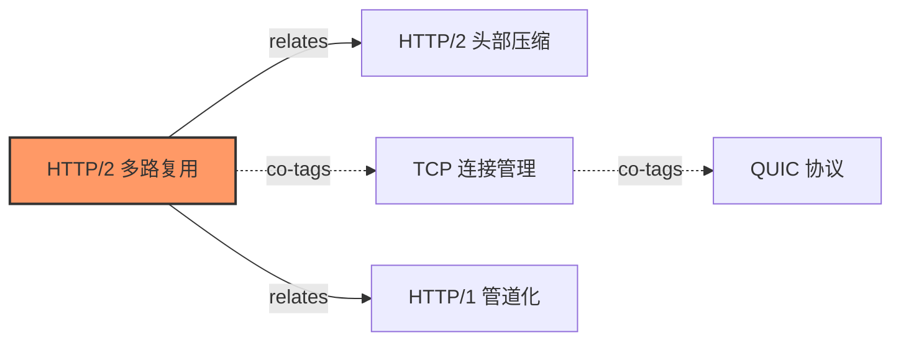

# PDF Module AI Agent 知识编译工作流指南

## 概述

本指南详细说明如何使用 AI Agent (Cursor/Claude Desktop) 进行 PDF 知识编译的完整工作流。这是 PDF Module 的核心使用场景。

## 核心理念

**Karpathy 编译器模式**: PDF 文档被预编译为结构化 Markdown 知识库，而非传统的 RAG 检索增强生成。

```
传统 RAG:  PDF → 向量索引 → 相似度检索 → 生成答案
编译器模式: PDF → Markdown 知识库 → 累积、可解释、可推理
```

---

## 完整工作流

### 工作流 1: 首次编译 PDF 到知识库

```
用户: 帮我把 /path/to/nginx-architecture.pdf 编译到知识库，领域是 IT

AI: [调用 compile_to_wiki 工具]
    参数: pdf_path="/path/to/nginx-architecture.pdf", knowledge_base="/kb", domain="IT"

返回结果:
{
  "raw_path": "/kb/raw/nginx-architecture.md",
  "entries": [{"title": "nginx-architecture", "domain": "IT", "status": "pending"}],
  "source_hash": "abc123...",
  "page_count": 45
}

AI: PDF 已提取到 raw/ 目录。现在我来阅读提取内容并提炼核心概念...

[AI 阅读 raw/nginx-architecture.md 和 raw/nginx-architecture.compile_prompt.md]

AI: 我提炼了以下 12 个核心概念，正在创建原子化词条:

1. [IT] Nginx_多进程架构.md
2. [IT] Nginx_事件驱动模型.md
3. [IT] Nginx_Master_Worker通信.md
4. [IT] Nginx_连接池管理.md
5. [IT] Nginx_内存池设计.md
...

[AI 创建词条到 wiki/it/ 目录，更新 wiki/index.md 和 wiki/log.md]

AI: 编译完成！创建了 12 个原子概念词条。
```

---

### 工作流 2: 增量编译新 PDF

```
用户: 我又添加了 3 个新 PDF 到 raw/ 目录，帮我增量编译

AI: [调用 incremental_compile 工具]
    参数: knowledge_base="/kb"

返回结果:
{
  "total_scanned": 3,
  "compiled": 2,
  "skipped": 1,
  "results": [...]
}

AI: 扫描了 3 个 PDF:
- paper1.pdf: 新文件，已编译
- paper2.pdf: 新文件，已编译  
- paper3.pdf: 哈希未变更，跳过

请查看新生成的编译提示文件，我将继续提炼概念...
```

---

### 工作流 3: 搜索知识库

```
用户: 搜索关于 HTTP/2 多路复用的知识

AI: [调用 search_knowledge 工具]
    参数: knowledge_base="/kb", query="HTTP/2 多路复用", limit=10

返回结果:
{
  "hits": [
    {"path": "it/http2_multiplex.md", "title": "HTTP/2 多路复用", "score": 0.95, "snippet": "..."},
    {"path": "it/http2_header_compression.md", "title": "HTTP/2 头部压缩", "score": 0.78, "snippet": "..."},
    {"path": "network/http2_vs_http1.md", "title": "HTTP/2 vs HTTP/1.1", "score": 0.72, "snippet": "..."}
  ]
}

AI: 找到 3 条相关知识:

1. **HTTP/2 多路复用** (相关度: 95%)
   路径: wiki/it/http2_multiplex.md
   摘要: HTTP/2 多路复用允许在单个 TCP 连接上并行发送多个请求...

2. **HTTP/2 头部压缩** (相关度: 78%)
   路径: wiki/it/http2_header_compression.md
   摘要: HPACK 算法通过静态字典和动态索引表压缩头部...

3. **HTTP/2 vs HTTP/1.1** (相关度: 72%)
   路径: wiki/network/http2_vs_http1.md
   摘要: HTTP/2 相比 HTTP/1.1 的核心改进包括多路复用、头部压缩...
```

---

### 工作流 4: 发现知识关联

```
用户: 帮我分析 HTTP/2 多路复用这个概念的相关知识

AI: [调用 get_entry_context 工具]
    参数: knowledge_base="/kb", entry_path="it/http2_multiplex.md", hops=2

返回结果:
{
  "entry": "it/http2_multiplex.md",
  "hops": 2,
  "neighbors": [
    {"path": "it/http2_header_compression.md", "hops": 1, "edge_kind": "related"},
    {"path": "it/tcp_connection.md", "hops": 1, "edge_kind": "tag_cooccurrence"},
    {"path": "network/http1_pipelining.md", "hops": 2, "edge_kind": "related"},
    {"path": "it/quic_protocol.md", "hops": 2, "edge_kind": "tag_cooccurrence"}
  ]
}

AI: 发现以下关联知识:

**直接关联 (1跳)**:
- HTTP/2 头部压缩 (related)
- TCP 连接管理 (标签共现)

**间接关联 (2跳)**:
- HTTP/1 管道化 (related)
- QUIC 协议 (标签共现)

建议阅读顺序: HTTP/1 管道化 → TCP 连接 → HTTP/2 多路复用 → HTTP/2 头部压缩 → QUIC 协议
```

---

### 工作流 5: 检测孤立条目

```
用户: 检查知识库中是否有孤立的知识条目

AI: [调用 find_orphans 工具]
    参数: knowledge_base="/kb"

返回结果:
{
  "orphan_count": 3,
  "entries": [
    "it/legacy_protocol.md",
    "math/old_theorem.md",
    "physics/unverified_concept.md"
  ]
}

AI: 发现 3 个孤立条目（无任何链接）:

1. it/legacy_protocol.md - 建议与 "协议演进" 相关条目建立链接
2. math/old_theorem.md - 可能需要归档或更新
3. physics/unverified_concept.md - 需要补充相关文献

是否需要我为这些条目生成链接建议？
```

---

### 工作流 6: 聚合 L1 到 L2

```
用户: 帮我发现可以聚合的原子概念

AI: [调用 aggregate_entries 工具]
    参数: knowledge_base="/kb"

返回结果:
{
  "candidates": [
    {
      "domain": "IT",
      "entry_paths": ["it/http2_multiplex.md", "it/http2_header_compression.md", "it/http2_stream.md"],
      "suggested_title": "IT 领域综合: HTTP/2 协议详解"
    },
    {
      "domain": "Network",
      "entry_paths": ["network/tcp_handshake.md", "network/tcp_retransmission.md", "network/tcp_flow_control.md"],
      "suggested_title": "Network 领域综合: TCP 协议核心机制"
    }
  ]
}

AI: 发现 2 个聚合候选:

**候选 1: HTTP/2 协议详解** (IT 领域)
- 包含 3 个 L1 条目: 多路复用、头部压缩、流控制
- 建议创建综述条目: wiki/it/http2_overview.md

**候选 2: TCP 协议核心机制** (Network 领域)
- 包含 3 个 L1 条目: 握手、重传、流控
- 建议创建综述条目: wiki/network/tcp_mechanisms.md

是否需要我创建这些 L2 综述条目？
```

---

### 工作流 7: 质量检查

```
用户: 检查知识库质量

AI: [调用 check_quality 工具]
    参数: knowledge_base="/kb"

返回结果:
{
  "total_entries": 156,
  "avg_quality_score": "82.5%",
  "issues_count": 12,
  "orphan_count": 3,
  "broken_links_count": 2,
  "has_warnings": true,
  "has_errors": false
}

AI: 知识库质量报告:

**总体状态**: 良好 ⚠️ 有警告

**统计**:
- 总条目: 156
- 平均质量分: 82.5%
- 问题数: 12
- 孤立条目: 3
- 失效链接: 2

**问题详情**:
| 严重度 | 条目 | 问题 |
|--------|------|------|
| WARN | it/old_api.md | 无标签 |
| WARN | math/formula.md | 质量分为 0 |
| WARN | physics/concept.md | 无标签 |
| INFO | it/new_feature.md | 质量分待评估 |

建议优先处理警告级别的问题。
```

---

### 工作流 8: 重编译单条目

```
用户: 重新编译 it/http2_multiplex.md，源 PDF 有更新

AI: [调用 recompile_entry 工具]
    参数: knowledge_base="/kb", entry_path="it/http2_multiplex.md"

返回结果:
{
  "entry_path": "/kb/wiki/it/http2_multiplex.md",
  "version": 2,
  "title": "HTTP/2 多路复用",
  "source_changed": true,
  "source_exists": true,
  "backup_path": "/kb/wiki/.versions/http2_multiplex_v1.md"
}

AI: 重编译完成:

- 版本: 1 → 2
- 源文件已变更，需要融合新内容
- 旧版本已备份到: .versions/http2_multiplex_v1.md

请阅读重编译提示，更新词条内容...
```

---

### 工作流 9: 矛盾推理

```
用户: 检查知识库中是否有矛盾的观点

AI: [调用 hypothesis_test 工具]
    参数: knowledge_base="/kb"

返回结果:
{
  "contradiction_pairs": [
    {
      "entry_a": "it/microservices_benefits.md",
      "entry_b": "it/monolith_advantages.md",
      "title_a": "微服务优势分析",
      "title_b": "单体架构优势分析"
    }
  ]
}

AI: 发现 1 对潜在矛盾:

**微服务优势分析** vs **单体架构优势分析**

这是架构选型的经典辩论。建议进行结构化分析:

1. **微服务主张**: 独立部署、技术异构、故障隔离
2. **单体主张**: 简单部署、事务一致性、调试便利
3. **共同点**: 都追求高可用、可扩展
4. **分歧点**: 复杂度分布位置不同

建议在两个条目中添加 `contradictions` 字段互相引用，并创建 "架构选型决策指南" 综述条目。
```

---

### 工作流 10: 导出概念图

```
用户: 导出 HTTP/2 相关的概念图

AI: [调用 export_concept_map 工具]
    参数: knowledge_base="/kb", entry_path="it/http2_multiplex.md", depth=2

返回结果:
{
  "mermaid": "graph LR\n    n0[\"HTTP/2 多路复用\"]:::center\n    n1[\"HTTP/2 头部压缩\"]\n    n2[\"TCP 连接管理\"]\n    n0 -->|relates| n1\n    n0 -.->|co-tags| n2\n    ..."
}

AI: 概念图已生成 (Mermaid 格式):



可将此图粘贴到 Obsidian、GitHub 或 mermaid.live 渲染。
```

---

## 最佳实践

### 1. 条目命名规范

```
✅ 推荐: [领域] 概念名称.md
   例: [IT] HTTP_2_多路复用.md
   例: [Math] 贝叶斯定理.md

❌ 避免: 第3章_概述.md
❌ 避免: paper_summary.md
```

### 2. 标签使用建议

```yaml
tags:
  - 核心概念标签 (如: http, networking)
  - 技术栈标签 (如: nginx, rust)
  - 关系标签 (如: protocol, architecture)
```

### 3. 链接维护

```yaml
related:
  - wiki/it/related_concept.md      # 相关概念
contradictions:
  - wiki/it/opposing_view.md        # 对立观点
aggregated_from:
  - wiki/it/source1.md              # L2 聚合来源
  - wiki/it/source2.md
```

### 4. 质量分评估

| 分数范围 | 含义 | 建议 |
|----------|------|------|
| 0.9-1.0 | 优秀 | 保持现状 |
| 0.7-0.9 | 良好 | 可补充细节 |
| 0.5-0.7 | 一般 | 需要扩展内容 |
| 0-0.5 | 待改进 | 建议重编译 |

---

## 故障排查

### 常见问题

| 问题 | 原因 | 解决 |
|------|------|------|
| 搜索无结果 | 索引未构建 | 调用 `rebuild_index` |
| 条目显示孤立 | 缺少 `related` 字段 | 调用 `suggest_links` |
| 增量编译跳过所有文件 | 哈希缓存问题 | 删除 `.hash_cache` 重新编译 |
| 概念图无法渲染 | Mermaid 语法错误 | 检查特殊字符转义 |

---

## 相关文档

- [客户端配置指南](./CLIENT_SETUP_GUIDE.md)
- [架构设计文档](../pdf-module-rs/ARCHITECTURE.md)
- [知识引擎模块](../pdf-module-rs/crates/pdf-core/src/knowledge/README.md)
